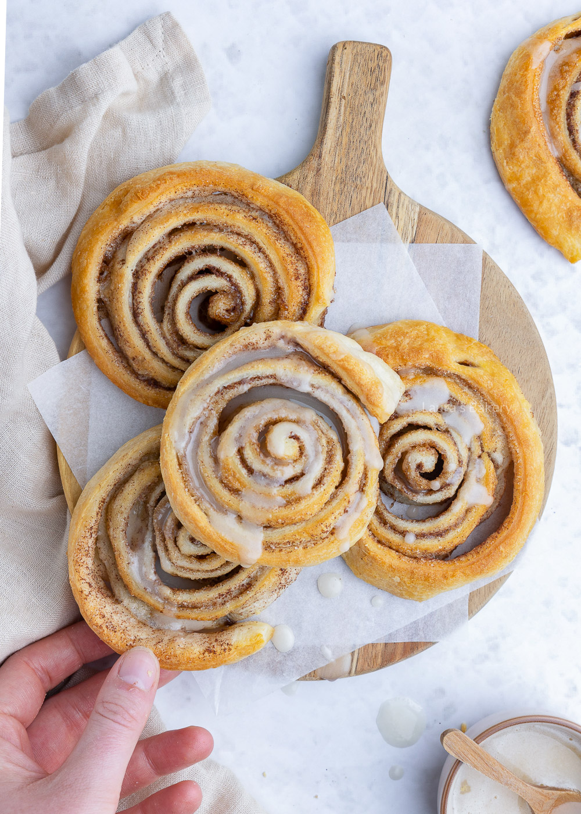

# recept

## Test
**SNELLE CINNAMON ROLLS RECEPT**
Het maken van kaneelbroodjes kan best een tijdje duren. Maar met dit recept voor snelle cinnamon rolls zijn je broodjes binnen no time klaar!

**PORTIES**: 6 stuks
**INGREDIËNTEN**
KANEEL BROODJE

* 1 blikje croissantdeeg
* 50 gram zachte boter
* 2 tl kaneel
* 50-60 gram lichtbruine basterdsuiker
GLAZUUR
* 100 gram poedersuiker
* 1 tl vanille extract
* 2 el melk

**INSTRUCTIES**

1. Rol het croissantdeeg uit op je werkblad. Knijp de naden dicht en druk ze goed aan.
2. Meng de kaneel door de zachte boter heen en smeer hier het croissantdeeg mee in. Hierover verdeel je de suiker gelijkmatig. Rol dan het croissantdeeg weer op. Probeer de naad een beetje dicht te knijpen.
3. Met een scherp mes snijd je de rol deeg in 6 plakjes. Leg deze op een met bakpapier beklede bakplaat.
4. Bak de snelle cinnamon rolls in 10-12 minuten op 200 °C (boven- en onderwarmte).
5. Terwijl ze in de oven staan maak je het glazuur. Roer poedersuiker, vanille extract en melk tot een dik glazuur.
6. Als de cinnamon rolls uit de oven komen serveer je ze gelijk met wat glazuur erover.
7. Smullen maar!

